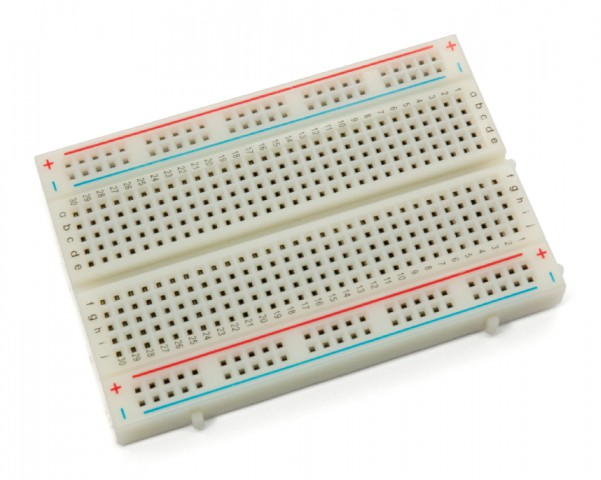

# cheap room climate control
cheap DIY room climate control with motion sensor
### Hallak mohamadanas - hm222ua

The goal of this project is to make a cheap climate control with motion sensor that can double as security system
This IoT device will show if the room is too hot or too cold, or too humid by LED and if it's red you can check through the dashboard

Estimated time to complete: 30 min without a dashboard and 1,5h with dashboard

## Objective
why I choose to make this: it's because climate change is catching up with us fast, and we just had a brutally hot summer
in Sweden and it has affected my sleep a lot because the housing in Sweden is isolated for cold winters the air
the outside might be cold, but the apartment will keep the heat it stored in the morning
with the help of this device i can tell when I walk into the room if it's too room climate is suitable for sleep
if it's not i can view through the dashboard what's wrong and crack a window or turn on the humidifier

## Material
**list of what you need**

| Component                                                      | Count | Specification | Picture |
|---------------------------------------------|:-----:|:------|---------|
| LoPy4                                                          |   x1  |A micropython micro controller that have difference communication ways:  WIFI, LoRa, Sigfox, Bluetooth ||
| Expansion board v3.1                                           |   x1  |Compatible with Pycom’s WiPy, LoPy, SiPy, FiPy, and GPy development boards. Needed to program and power the LoPy4 board.||
| Micro USB cable                                                |   x1  |Allows you to connect to your micropython with computer for programming.||
| Breadboard                                                     |   x1  |A board wich you can make electical circuit without soldering||
| motion sensor (hc-sr501)                            |   x1  |motion sensor||
| Digital temperature and humidty sensor (DHT-11 with integrated resistance) |   x1  |Read the temprature and humidty||
All of parts can be found on amazon nothing exotic here so dont worry i got them all in 37sensor kit and it costed 40 doller ecept the LoPy4 and Expansion board v3.1 you can buy them dircatly from pycom.io for 50 dollars

## Computer setup
I'm used to VS code, but please **avoid** it. The plugin that's called PyMakr is fully broken at the time of publishing this tutorial. 

I wasted weeks trying to get it to work, not realizing it's broken, and after a lot of suffering, I realized that the plugin works on Atom 
sorry for the rant. I just needed to ensure that you (the person replicating this at home) didn't waste as much time as I did.

Now what you need to do is simple:

you start by installing [Atom](https://flight-manual.atom.io/getting-started/sections/installing-atom/) and Navigate to the Install page via Atom > Preferences > Install

Search for Pymakr and select the official Pycom Pymakr Plugin

you need this plugin to communicate with the pycom and upload your code 

If you have any problems installing it you can follow this [Guide](https://docs.pycom.io/gettingstarted/software/atom/)

Note that you might need to install dependencies programs like[Node.js](https://nodejs.org/en/download/) Atom will notify you if you need any on the bottom right corner of the screen. 

**Device firmware update**
if you are experiencing bugs or glitches, especially with the IoT environment, Adafruit. consider updating your firmware by following this guide [here](https://docs.pycom.io/updatefirmware/device/).

## Putting everything together

For this part of the tutorial, I will use the color of the cables to show what pin on each device do
When flowing this tutorial try to connect each device at the time and then put them together like legos I found that this is the easiest way

first the pycom

as you see there are four cables to connect to the pycom 
Red from VIN to + on Breadboard  
White from GND to - on Breadboard 
purple from P23 to middle pin on motion sensor
Black from P3 to left Pin on DHT 

DHT

there are three cables to connect in this step 
gray from the right pin to - on Breadboard 
white from the middle pin to + on Breadboard  
Black from left to P3 on the Pycom

motion sensor 

there are three cables to connect in this step too
Gray from the left pin to - on Breadboard 
Blue from the right pin to + on Breadboard  
Purple from the middle pin on the motion sensor to P23 on Pycom

Breadboard 

on the Breadboard, the cables come in pairs 
on the top, there are the Red to + and the white to - from the pycom
then there is the gray to - and white to + from DHT
last we have gray to - and Blue to + from the motion sensor 

In case the readings from the motion sensor come back always high then switch the gray and blue cables

